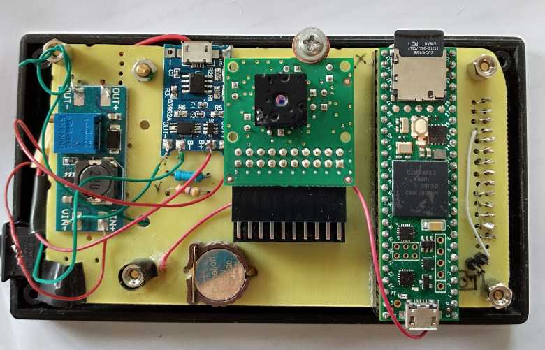
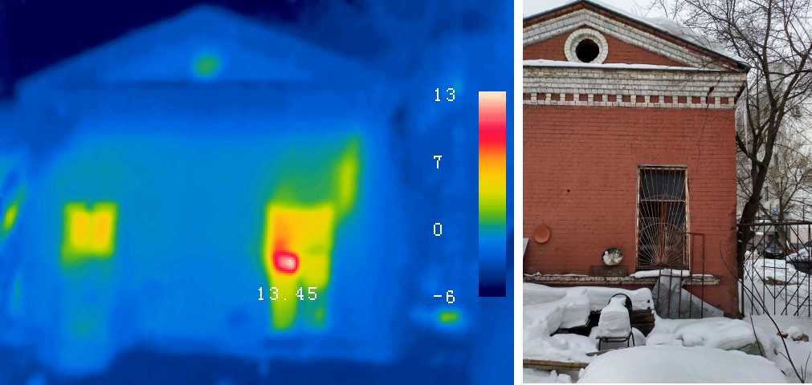
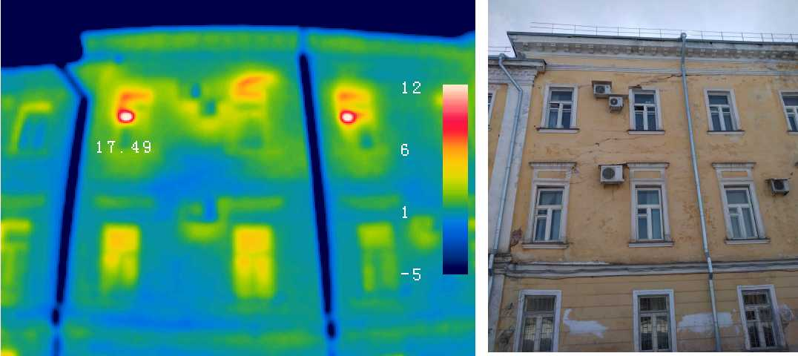

**My patch for DIY_thermocam project by Max Ritter.**
trunk is here https://github.com/maxritter/DIY-Thermocam

Features:
-Thermal sensor is rotated (due to pcb layout)
-Spi display instead of display with parallel interface
-Keypad instead of touchscreen

